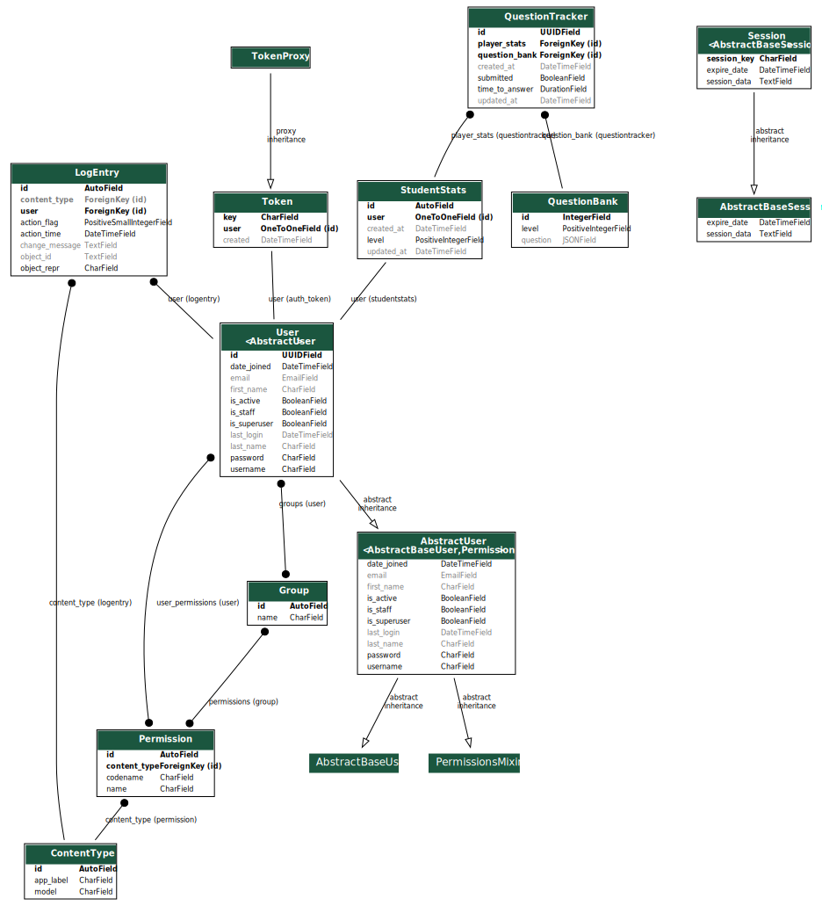
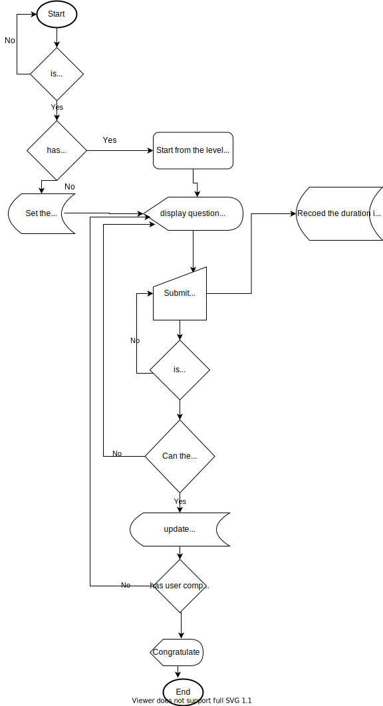

# KodoMathOps

[](https://github.com/girisagar46/KodoMathOps/actions?query=workflow%3Alint)
[](https://github.com/agconti/cookiecutter-django-rest)

A Backend API for a MVP of an application to learn the basic mathematical operations. Developed for the company KodoMath.. Check out the project's [documentation](http://girisagar46.github.io/KodoMathOps/).

# Prerequisites

- [Docker](https://docs.docker.com/docker-for-mac/install/) (To make MySQL setup easy)

# Local Development

## Using Docker to run whole stack

1. Clone the repo
   ```bash
   git clone git@github.com:girisagar46/KodoMathOps.git
   ```

1. Go into the repo
   ```bash
   cd KodoMathOps
   ```

1. Prepare virtual environment, activate it and install requirements

   ```bash
   python3 -m venv venv
   ``` 
   
   ```bash
   source venv/bin/activate
   ```
   
   ```bash
   pip3 install -r requirements.txt
   ```

1. Start the MySQL server:
    ```bash
    docker-compose up
    ```

1. Copy `.env.example` to `.env` and export the variables
   ```bash
   cp .env.example .env && export $(xargs < .env)
   ```

1. Do the migration
   ```bash
   ./manage.py migrate
   ```
   
1. Load the initial fixture (this is to populate data in local env)
   ```bash
   ./manage.py loaddata ./fixtures/question_bank.json
   ```

1. Create superuser
   ```bash
   ./manage.py createsuperuser
   ```

1. Run the server
   ```bash
   ./manage.py runserver
   ```

1. Visit [http://localhost:8000/swagger/](http://localhost:8000/swagger/) for API Documentation

1. Visit [http://localhost:8000/admin/](http://localhost:8000/admin/) to get into the Admin dashboard.

1. Use `api-test.http` to play around with the api.
   Note: Make sure to update the auth token and question_id before submitting answer :) 

# DB Schema



# Application Flow Chart


